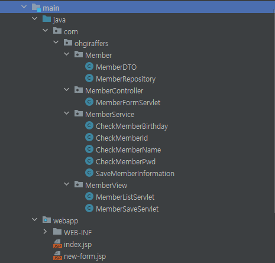
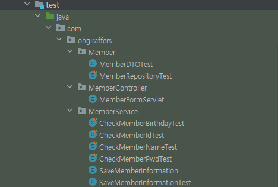

# Final - ServerMaker

---

## 1. 프로젝트 소개

---
> 회원가입, 회원 정보 목록을 조회하는 Servlet 페이지 만들기

--- 
## 2. 프로젝트 설명

---
> 이름, 생년월일, 아이디, 비밀번호, 비밀번호 확인을 통해 회원가입을 진행하고 회원가입 성공 시
> 등록되어 있는 회원 정보 목록을 조회하는 페이지를 만든다.

---
## 3. 프로젝트 기능

---
> 1. 아이디 중복여부 검증
> 2. 비밀번호, 비밀번호 확인 창의 정보 일치 여부 검증
> 3. 회원가입 성공 시 회원 목록을 불러올 수 있는 로직
> 4. 회원가입 성공 시 저장되는 회원의 정보
> 5. 검증에 실패할 시 Error 페이지

--- 
## 4. 프로젝트 요구사항

---
* 이름은 NULL, 특수문자, 숫자, 띄어쓰기가 포함되면 안 된다.
* 이름은 2~30자 이내여야 한다.
* 아이디는 회원가입 할 시에 NULL,공백문자,특수문자를 포함하면 안된다.
* 아이디는 최소 5글자에서 최대 12글자로 작성해야 한다.
* 아이디는 이미 등록되어 있는 아이디와 중복되면 안된다. 
* 비밀번호는 특수 문자, 숫자, 영문(대소문자 구분 없음)을 각 1개 이상 포함해야 한다.
* 비밀번호에는 공백과 null이 들어가면 안된다.
* 비밀번호는 최소 5글자에서 최대 12글자로 작성해야 한다.
* 비밀번호는 비밀번호 재확인과 입력값이 동일한 지 확인해야 한다.
* 생년월일은 Date로 받는다.
* 회원 목록을 조회할 시 이름, 생년월일, 아이디를 불러와야 한다.
* 생년월일을 회원가입 시 미성년자(05년생 이하)는 회원가입이 불가하다.
* 모든 기능은 검증에 실패할 시 해당 Error 페이지로 이동한다.
* Repository는 싱글톤 방식으로 생성해야한다.

---
## 5. 프로젝트 제약사항

---

* 가독성 있는 코드로 작성
* 메소드 이름은 반드시 명령문 형태
* 테스트 메소드 충분히 검증
* 개인의 구현은 반드시 브랜치 생성 후 구현
* 모든 작업이 끝난 후 Pull Request 생성
* PR에 모든 팀원이 코드 리뷰
* 마지막 리뷰어는 Merge 수행

---
## 6. 프로젝트 패키지 구조

---
### main 패키지 구조

---
### test 패키지 구조

---
## 7. 프로젝트 주요 Method

---
> checkBirth(생년월일 확인), checkId(아이디 확인), checkPwd(비밀번호 확인)
> checkName(이름 확인), findAllId(아이디 중복 확인)

---

## 8. 프로젝트 검증 내용

---
* 아이디 중복여부에 따른 회원가입 가능여부
* 아이디 조건 불일치에 따른 회원가입 가능여부
* 이름 조건 불일치에 따른 회원가입 가능여부
* 비밀번호 조건 불일치에 따른 회원가입 가능여부
* 비밀번호 , 비밀번호 확인 조건에 따른 회원가입 가능여부
* 생년월일 조건 불일치에 따른 회원가입 가능여부
* 회원가입 완료 시 회원가입 성공한 사람의 이름 조회여부
* 회원가입을 완료한 사람들의 목록 조회여부

